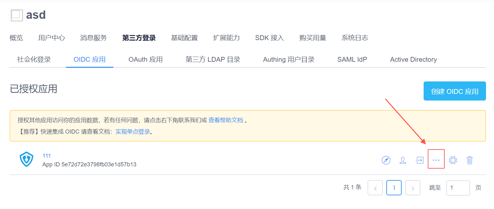
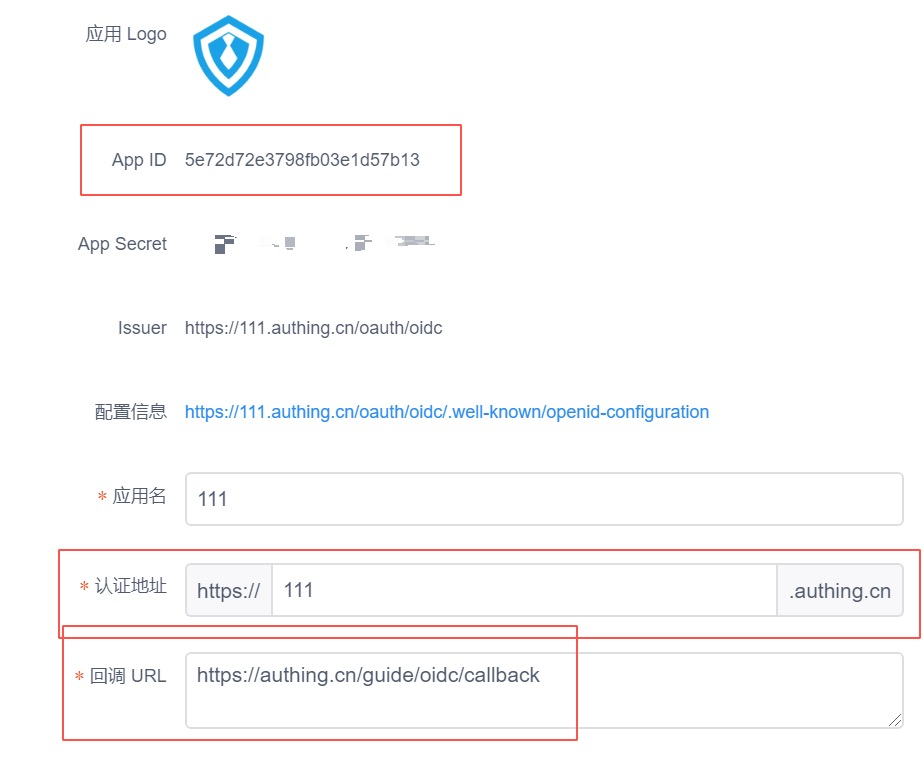
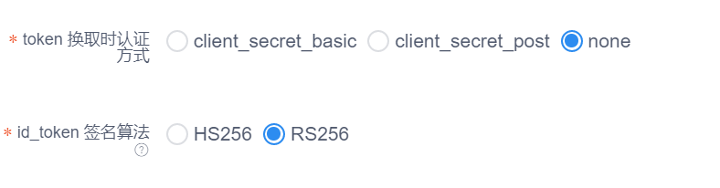
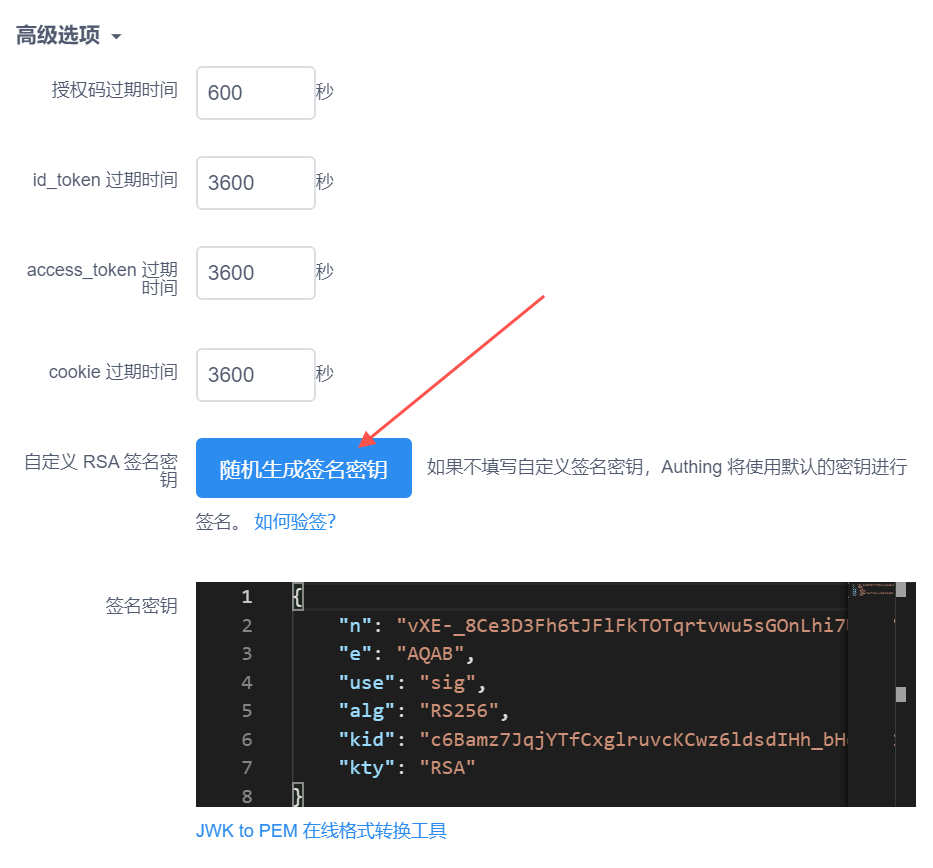
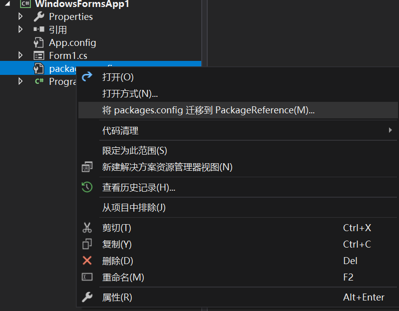

# Authing OIDC SDK for .Net

[Authing](https://authing.cn/) 是一个企业级身份认证提供商，其集成了 OAuth、LDAP、OIDC 等多种身份认证和授权解决方案。

Authing OIDC SDK for .Net 是 Authing 提供的在 Windows 平台上进行 OIDC 登录的解决方案，
开发者可以在 Winforms、WPF 应用程序中快速接入，并使用其进行认证。

## 准备工作

- .NET Framework 4.6.2
- Visual Studio 2017 或以上
- Authing 账号，可以[在此注册](https://console.authing.cn/register)


首先，[登录](https://console.authing.cn/login) Authing 进入 [控制台](https://console.authing.cn)，并在 `第三方登录`->`OIDC 应用` 中取得应用的 AppId、AppDomain 和 回调地址。

**为了更高的安全性，建议为客户端创建新的 OIDC 应用。**





由于在客户端使用 App Secret 是不安全的行为，也就无法使用 secret 进行认证和校验，所以需要修改下面的 `认证方式` 和 `签名算法`。



最后，请在高级选项中填写 `签名密钥`，可以在以下操作中**二选一**：

**一、点击 `随机生成签名密钥` 按钮**



**二、使用默认密钥**

如果希望使用 Authing 默认的密钥，请在 `签名密钥` 处粘贴以下内容：

```json
{
    "kty":"RSA",
    "e":"AQAB",
    "kid":"893ed9df-80f0-4d40-b697-732b6e267d18",
    "n":"xRijj2seoesv5K0Z-ymRK7DSDPxdsM2sGQD2ZVhLjLsxZWJtXUXh7ERdUU6OT3BqYZZf7CLIhN6yyNtTOgfgpLG9HVJd7ZSKzuy2dS7mo8jD8YRtptAJmNFqw6z8tQp5MNG1ZHqp9isKqJmx_CFYkRdXBmjjj8PMVSP757pkC3jCq7fsi0drSSg4lIxrSsGzL0--Ra9Du71Qe_ODQKU0brxaI1OKILtfcVPTHTaheV-0dw4eYkSDtyaLBG3jqsQbdncNg8PCEWchNzdO6aajUq4wbOzy_Ctp399mz0SGKfuC5S8gqAFABFT3DH3UD21ZztQZwFEV2AlvF-bcGEstcw"
}
```

## 安装

使用 NuGet 进行安装，根据需要选择对应的库。

### Winforms

```bash
$ Install-Package Authing.OidcClient.Winforms
```

### WPF

```bash
$ Install-Package Authing.OidcClient.WPF
```

## 使用

完整的示例在 [test](./test) 目录下。

### 初始化

在项目中可以使用这些参数创建一个 `AuthingClient` 实例。

```c#
var client = new AuthingClient(new AuthingClientOptions() {
    AppId = "your_app_id",
    AppDomain = "your_app_domain",
    // 登录成功后的回调地址
    RedirectUri = "your_redirect_uri",
    // 注销后的回调地址
    PostLogoutRedirectUri = "your_post_logout_redirect_uri",
});
```

### 登录

登录为异步操作，返回的结果中包括 token 和用户信息。

```c#
// 获取登录结果
var loginResult = await client.LoginAsync();

// token 信息
print($"id_token: {loginResult.IdentityToken}");
print($"access_token: {loginResult.AccessToken}");
print($"refresh_token: {loginResult.RefreshToken}");

// 用户信息
foreach (var claim in loginResult.User.Claims)
{
    print($"{claim.Type} = {claim.Value}");
}
```

如果需要获得用户的某种信息，例如电话和 email，可以使用如下方法：

```c#
var phone = loginResult.User.FindFirst("phone");
var email = loginResult.User.FindFirst("email");
```

### 注销

注销为异步操作，默认为静默注销，不显示窗口。

```c#
var LogoutResult = await client.LogoutAsync();
```

## FAQ

### 一、安装包之后项目生成失败，提示 `must use packagereference`

需要将 NuGet 包配置文件升级为新版的方式，步骤如下：

1. 找到项目中的 packages.config；
2. 右键点击并选择 `将 packages.config 迁移到 PackageReference`



具体可以参考[这里](https://blogs.perficient.com/2019/06/04/moving-from-nuget-package-config-to-packagereference/)

## 获取帮助

1. Gitter: [#authing-chat](https://gitter.im/authing-chat/community)

## 开发者信息

[Authing](https://authing.cn)

## License

This project is licensed under the MIT license. See the LICENSE file for more info.
